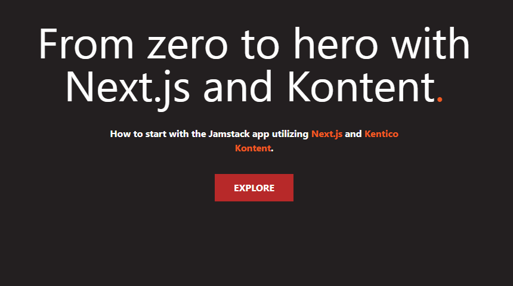

# A Statically generated page using Next.js and Kontent

[](https://vercel.com/chrastinaondra/kontent-boilerplate-next-js)

[](https://github.com/Kentico/Home/discussions)
[](https://stackoverflow.com/tags/kentico-kontent)

This boilerplate showcases [Next.js](https://nextjs.org)'s Static Generation feature using [Kontent by Kentico](https://kontent.ai) as the data source.

[](https://kontent-boilerplate-next-js-rust.vercel.app)

## Demo

* <https://kontent-boilerplate-next-js-rust.vercel.app/>

## Getting Started

### Deploy to Vercel

[](https://vercel.com/new/git/external?repository-url=https://github.com/Kentico/kontent-boilerplate-next-js&project-name=kontent-boilerplate-next-js&repository-name=kontent-boilerplate-next-js&env=KONTENT_PROJECT_ID&envDescription=Required%20to%20connect%20the%20app%20with%20Kontent&envLink=https://github.com/Kentico/kontent-boilerplate-next-js%23Environment-variables)

### Init project by command line

Execute [`create-next-app`](https://github.com/vercel/next.js/tree/canary/packages/create-next-app) with [npm](https://docs.npmjs.com/cli/init) or [Yarn](https://yarnpkg.com/lang/en/docs/cli/create/) to bootstrap the example:

```bash
npx create-next-app --example https://github.com/Kentico/kontent-boilerplate-next-js kontent-boilerplate-next-js
# or
yarn create next-app --example https://github.com/Kentico/kontent-boilerplate-next-js kontent-boilerplate-next-js
```

## Code development

### Environment variables

1. Set up environment variables
    * Copy the `.env.local.template` file in this directory to `.env.local` (which will be ignored by Git):

        ```sh
        cp .env.local.template .env.local
        ```

1. Run the development server:

    ```bash
    npm run dev
    # or
    yarn dev
    ```

🎉 Open [http://localhost:3000](http://localhost:3000) with your browser to see the result.

You can start editing the page by modifying `pages/index.js`. The page auto-updates as you edit the file.

> By default, the content is loaded from a shared Kontent project. If you want to use your own clone of the project so that you can customize it and experiment with Kontent, continue to the next section.

## Create your own data source project in Kontent

> The model is simple one content model end one item based on it. If you want content model details, checkout [Prepare content section in my article](https://dev.to/kentico-kontent/jamstack-on-net-from-zero-to-hero-with-statiq-and-kontent-p4m#prepare-content). It is describing the same content model but for different technology.

### Create Kontent project

1. Create an account on Kontent
    * [Create an account on Kontent.ai](https://app.kontent.ai/sign-up?utm_source=nextjs_boilerplate_example&utm_medium=devrel).
1. After signing up, [create an empty project](https://kontent.ai/learn/tutorials/manage-kontent/projects/manage-projects#a-create-projects).
1. Go to the "Project Settings", select API keys and copy the following keys for further reference
    * Project ID
    * Management API key
1. Use the [Kontent Backup Manager](https://github.com/Kentico/kontent-backup-manager-js) and import data to the newly created project from [`kontent-backup.zip`](./kontent-backup.zip) file via command line:

       ```sh
        npm i -g @kentico/kontent-backup-manager@1.14.0
        # or
        yarn global add @kentico/kontent-backup-manager@1.14.0
    
        kbm --action=restore --projectId=<Project ID> --apiKey=<Management API key> --zipFilename=kontent-backup
        ```
1. Go to your Kontent project and [publish the imported item](https://kontent.ai/learn/tutorials/write-and-collaborate/publish-your-work/publish-content-items).

### Connect Kontent project with code base

1. Set env variables on `.env.local`:
    * `KONTENT_PROJECT_ID` - Should be the Project ID in `Project settings` > `API keys`.

### Content editing development

Run the development server:

```sh
npm run dev
# or
yarn dev
```

🎉 Open [http://localhost:3000](http://localhost:3000) with your browser to see the result.

You can start editing the page by modifying content in Kontent project. The page auto-updates as you edit the content, you just need to [publish the changes](https://kontent.ai/learn/tutorials/write-and-collaborate/publish-your-work/publish-content-items).

#### Preview

Next.js offers embedded possibility to preview unpublished content - [the preview mode](https://nextjs.org/docs/advanced-features/preview-mode). If you want to include this capability - follow the linked guide, or jum straight to the [Kontent example](https://github.com/vercel/next.js/tree/canary/examples/cms-kontent) that already includes implementation of the [preview](https://github.com/vercel/next.js/blob/canary/examples/cms-kontent/pages/api/preview.js) and [exit-preview](https://github.com/vercel/next.js/blob/canary/examples/cms-kontent/pages/api/exit-preview.js) API route.

## Learn More

To learn more about Next.js, take a look at the following resources:

* [Kontent + Next.js blog example](https://github.com/vercel/next.js/tree/canary/examples/cms-kontent#readme) - complex sample project setup including i.e. preview functionality, listing, Tailwind CSS, ...
* [Next.js Documentation](https://nextjs.org/docs) - learn about Next.js features and API.
* [Learn Next.js](https://nextjs.org/learn) - an interactive Next.js tutorial.
* [This Mission: Next.js from the Ground Up](https://explorers.netlify.com/learn/nextjs)

You can check out [the Next.js GitHub repository](https://github.com/vercel/next.js/) - your feedback and contributions are welcome!

### Related content

- [Using the Next image component with Kontent assets](https://meeg.dev/blog/using-the-next-image-component-with-kentico-kontent-assets) by [Chris Meagher](https://github.com/CMeeg)
- [Using Azure Pipelines to build and deploy a Next.js app to Azure app services](https://meeg.dev/blog/using-azure-pipelines-to-build-and-deploy-a-next-js-app-to-azure-app-services) by [Chris Meagher](https://github.com/CMeeg)
- [Build and Deploy a Next.js Blog with Kontent and Vercel](https://dev.to/kentico-kontent/build-and-deploy-a-next-js-blog-with-kentico-kontent-and-vercel-5cp4) by [Ondřej Chrastina](https://github.com/Simply007)
- [Dynamic routing with Kontent and NextJS](https://unplatform.io/stories/dynamic-routing-with-kentico-kontent-and-nextjs) by [Unplatform](https://unplatform.io/)
- [Solving content preview with Next.js Preview Mode](https://rshackleton.co.uk/articles/solving-content-preview-with-next-js-preview-mode) by [Richard Shackleton](https://rshackleton.co.uk/)
- [How to use Highlight.js on a Next.js site](https://dev.to/kentico-kontent/how-to-use-highlight-js-on-a-next-js-site-f9) by [Ondřej Polesný](https://github.com/ondrabus)
- [Pre-rendered, server-rendered, or hybrid: Which should I use?
](https://kontent.ai/blog/pre-rendered-server-rendered-or-hybrid-which-should-i-use) by [Tom Marshall](https://kontent.ai/blog/author/tom-marshall) 
